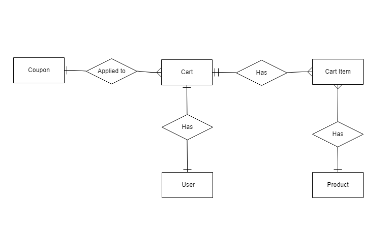

## Cart Backend

#### Used technologies & Packages

- Node.js
- RDBMS
- express.js - Web application framework
- dotenv - For managing environment variables
- jsonwebtoken - For handling jwt signing and verifying
- sequelize ORM - To abstract the data access layer

### Features

- User authentication
- Add / remove / update cart items
- Apply coupons (percent or fixed)

### Database

The choice of a RDBMS over document based system (MongoDB) came from the existence of many relations between entities, representing those relations using a document model would require app code to handle joins & enforcing relations.

The following is ERD of the database

### API Routes

/login POST - Authenticates user and returns a jwt token  
/products GET - Returns available products

### Cart & coupon routes require JWT token to identify user

/cart GET - Returns user's cart contents  
/cart POST - Adds an item to user's cart  
/cart/:itemId DELETE - Deletes item from user's cart  
/cart/:itemId PATCH - Updates an item's quantity  
/coupon/check POST - Check if code is valid & not expired  
/coupon/apply POST - Apply coupon if valid to user's cart

### Useful links

[Example repo of how to structure sequelize ORM files](https://github.com/sequelize/express-example)  
[Youtube tutorial about sequelize ORM](https://www.youtube.com/watch?v=ExTZYpyAn6s)

### Live preview

https://mighty-savannah-81111.herokuapp.com/api
